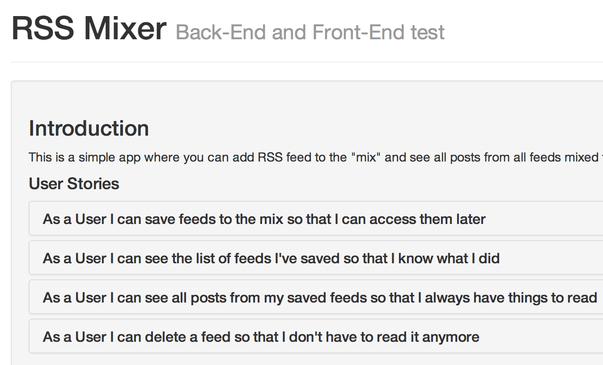

rss-mixer-template
==================

Starter template for RSS Mixer Test

Getting Started
---------------

The only thing you need is django installed in your python path. If you don't, just run:

    pip install django

To initiate the project run:

    django-admin.py startproject --template=https://github.com/360youlun/rss-mixer-template/archive/master.zip rss
    cd rss
    python manage.py runserver

Open http://127.0.0.1:8000/ in the browser and you're all set:

